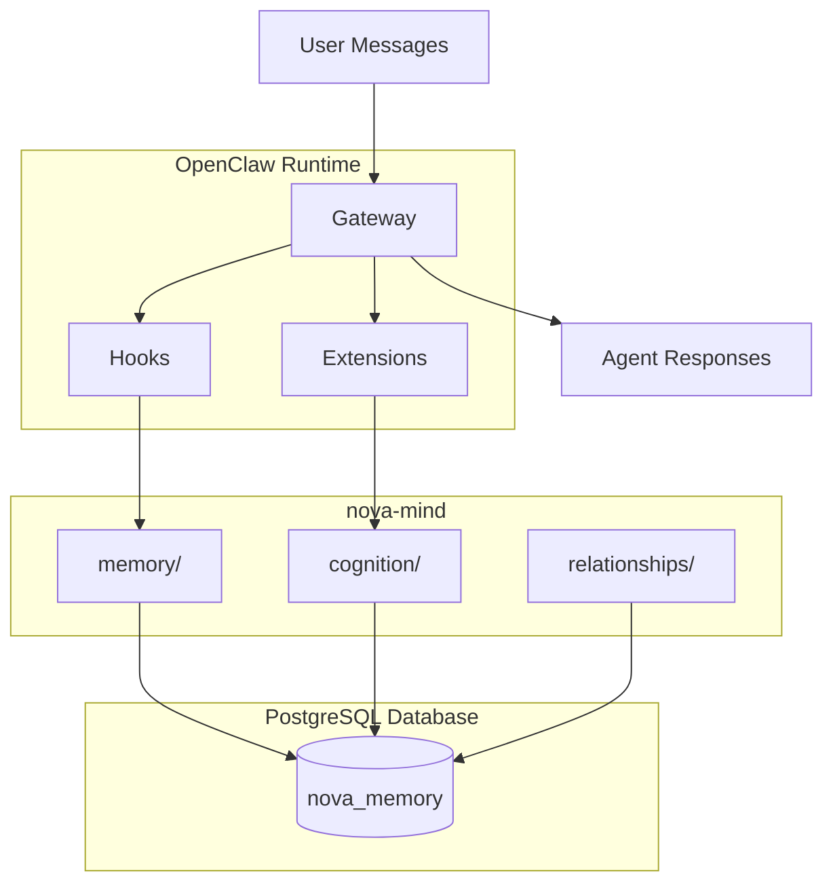

# nova-mind Architecture

NOVA's unified agent mind stack combining memory, cognition, relationships, psyche, and motivation into a cohesive PostgreSQL-backed system.

> *Memory, thought, trust, self—*
> *five rivers join, flow as one*
> *mind holds what it meets*
>
> — **Erato**

## Recommended Reading Order

To understand nova-mind from the ground up:

1. **`ARCHITECTURE.md`** (this file) — System overview, data flows, and design decisions
2. **`SOUL.md` / `IDENTITY.md` / `USER.md` / `AGENTS.md`** — Behavioral root and operational manual
   - For a single-user assistant, `SOUL.md` + `USER.md` are the true behavioral root; `AGENTS.md` is the operational manual
3. **`memory/ARCHITECTURE.md`** — Memory tiers, extraction pipeline, and PostgreSQL schema
4. **`relationships/ARCHITECTURE-entity-resolver.md`** — Entity resolution and caching
5. **`database/schema-reference.md`** — Complete table reference and access control documentation

## Getting Started: Minimum Viable Setup

Most value for least complexity:

1. **`entity_facts` table** — Simple key-value pairs with confidence, source, and visibility tracking. Foundation of all entity knowledge.
2. **`SOUL.md` + bootstrap identity pattern** — The `agent_bootstrap_context` table seeds agent personality and SOPs at session start with minimal overhead.

These two give you persistent, queryable knowledge about entities plus behavioral consistency across agent sessions. Add the extraction pipeline and embeddings when you need automatic learning from conversation.

## Maintenance Hotspots

The most maintenance-heavy component is the **embeddings pipeline**:
- Migration between embedding models (e.g., OpenAI 1536-dim → Ollama 1024-dim) requires full re-embedding
- Orphaned vector cleanup (`memory_embeddings` containing stale entries from deleted source records)
- Cron job failures (Ollama service down, API timeouts)
- IVFFlat index retraining as dataset grows

Other subsystems (`entity_facts`, `agent_bootstrap_context`, `agent_chat`) require little-to-no routine maintenance.

## System Overview

nova-mind is a unified repository consolidating five previously separate subsystems:

- **`memory/`** — Persistent PostgreSQL memory with semantic recall, extraction hooks, and structured schema for entities, facts, relationships, events, and lessons.
- **`cognition/`** — Agent orchestration, inter-agent messaging (`agent_chat`), bootstrap context seeding, and the `agent-config-sync` system that keeps model configuration in sync with the database.
- **`relationships/`** — Entity resolution across platforms, session-aware caching, certificate-based agent identity (Web of Trust), and the social graph.
- **`psyche/`** — Agent self-awareness design: core values, agent-chat architecture, entity/user identity models, and identification protocols. (Migrated from archived `nova-psyche` repo.)
- **`motivation/`** — Drive assignment, goal tracking, reward signals, and proactive mode orchestration. (Migrated from archived `nova-motivation` repo.)

All five subsystems share a single PostgreSQL database (`{username}_memory`) and are installed via a unified installer (`agent-install.sh`) that ensures idempotent, declarative deployments.

### High-Level Architecture Diagram



## Three Pillars

### 1. Memory System (`memory/`)

**Purpose:** Long-term structured storage with semantic recall capabilities.

**Core Components:**
- **Schema Management:** Declarative schema via `pgschema` (plan → hazard-check → apply)
- **Extraction Pipeline:** Natural language → Claude extraction → structured JSON → PostgreSQL
- **Embedding Engine:** Local Ollama (`snowflake-arctic-embed2`) for semantic search over memories
- **Hook Integration:** Two managed hooks + one Plugin SDK plugin automate memory operations:
  - `memory-extract` — Extracts structured memories from incoming messages
  - `session-init` — Generates privacy-filtered context at session start
  - **turn-context plugin** — Consolidates the old `semantic-recall` and `agent-turn-context` hooks. Runs entity resolution, semantic recall, and turn-reminder injection in parallel via `before_prompt_build`.

**Key Tables:**
- `entities`, `entity_facts`, `entity_relationships` — People, organizations, facts, and connections
- `events`, `lessons` — Timeline and learned experiences (with confidence decay)
- `projects`, `tasks` — Active work tracking
- `agent_turn_context` — High‑priority context injected every turn
- `media_consumed`, `artwork` — Media tracking and generated content
- `memory_embeddings` — Vector embeddings for semantic search (1024‑dim)

### 2. Cognition System (`cognition/`)

**Purpose:** Agent orchestration, delegation patterns, and configuration synchronization.

**Core Components:**
- **Agent Chat:** Database‑backed inter‑agent messaging with PostgreSQL `NOTIFY/LISTEN`
- **Agent Config Sync:** Extension plugin that syncs `agents` table → `agents.json` → hot‑reload
- **Jobs System:** Task tracking layer atop agent‑chat for reliable handoffs
- **Bootstrap Context:** Session‑level initialization (`agent_bootstrap_context` table)
- **Delegation Context:** Dynamic context generation for "who can help" decisions

**Key Tables:**
- `agent_chat`, `agent_chat_processed` — Message queue and delivery tracking
- `agent_jobs`, `job_messages` — Task coordination with pipeline routing
- `agents` — Registry of AI agent instances with model, access, and capability metadata
- `agent_aliases` — Case‑insensitive identifier matching
- `agent_system_config` — System‑wide agent configuration
- `agent_turn_context` (shared with memory) — Per‑turn injection

### 3. Relationships System (`relationships/`)

**Purpose:** Entity perception, profiling, resolution, and trust infrastructure.

**Core Components:**
- **Entity Resolver Library:** Identity resolution across phone, email, UUID, certificate CN
- **Session‑Aware Caching:** Per‑session entity caching (30‑minute TTL)
- **Certificate Authority:** Private CA for mTLS authentication and Web of Trust
- **Profile Management:** Dynamic profiling with behavioral/trait schema
- **Analysis Algorithms:** Confidence scoring, frequency analysis, longitudinal patterns

**Key Tables:** (extends memory schema)
- `entities`, `entity_facts`, `entity_relationships` — Shared with memory
- `certificates` — Client certificates for agent authentication
- `entity_fact_conflicts` — Contradiction tracking

## Data Flow

### 1. Incoming Message Pipeline

```
User Message
    ↓
OpenClaw Gateway (message:received event)
    ↓
memory-extract hook → Claude extraction → entities/facts/opinions → PostgreSQL
turn-context plugin → entity resolution + semantic recall + turn reminders (parallel)
    ↓
Agent Processes Message (with enriched context)
    ↓
Agent Response → User
```

### 2. Inter‑Agent Communication

```
Agent A → send_agent_message('Agent B', 'task')
    ↓
INSERT INTO agent_chat → PostgreSQL NOTIFY('agent_chat')
    ↓
Agent B's OpenClaw plugin (LISTEN) → route to session
    ↓
Agent B processes → mark as processed
    ↓
Optional: job tracking via agent_jobs
```

### 3. Configuration Synchronization

```
UPDATE agents SET model = '...'
    ↓
Trigger notify_agent_config_changed()
    ↓
agent-config-sync plugin (LISTEN) → query agents table
    ↓
Write ~/.openclaw/agents.json (atomic rename)
    ↓
OpenClaw file watcher → hot‑reload agents.* config
    ↓
All subsequent spawns use new model
```

### 4. Entity Resolution Flow

```
Identifier (phone, email, UUID, cert CN)
    ↓
resolveEntity() → check cache → query database
    ↓
Entity found → load profile facts (timezone, communication_style, ...)
    ↓
Cache for session (30‑minute TTL)
    ↓
Return entity + profile for personalization
```

## Database Schema (Key Tables)

| Table | Subsystem | Purpose | Key Columns |
|-------|-----------|---------|-------------|
| `entities` | Memory/Relationships | People, AIs, organizations, concepts | `id`, `name`, `full_name`, `type` |
| `entity_facts` | Memory/Relationships | Key‑value facts about entities | `entity_id`, `key`, `value`, `confidence` |
| `entity_relationships` | Memory/Relationships | Connections between entities | `from_entity_id`, `to_entity_id`, `relationship_type`, `strength` |
| `events` | Memory | Timeline of what happened | `id`, `event_date`, `description`, `significance` |
| `lessons` | Memory | Learned experiences (confidence decay) | `lesson`, `context`, `confidence`, `last_referenced` |
| `projects` | Memory | Active work with Git configuration | `name`, `status`, `goal`, `git_config`, `locked` |
| `tasks` | Memory | Actionable items linked to projects | `project_id`, `title`, `status`, `assigned_to` |
| `agents` | Cognition | Registry of AI agent instances | `name`, `model`, `thinking`, `access_method`, `access_details`, `allowed_subagents` |
| `agent_chat` | Cognition | Inter‑agent message queue | `sender`, `message`, `recipients`, `"timestamp"` |
| `agent_jobs` | Cognition | Task coordination with pipeline routing | `title`, `topic`, `agent_name`, `status`, `notify_agents` |
| `agent_turn_context` | Memory/Cognition | Per‑turn critical context injection | `context_type`, `domain_name`, `content` (≤500 chars) |
| `agent_bootstrap_context` | Cognition | Session‑level initialization context | `context_type`, `domain_name`, `file_key`, `content` |
| `memory_embeddings` | Memory | Vector embeddings for semantic search | `source_type`, `source_id`, `embedding` (vector(1024)) |
| `channel_sessions` | Memory | Structured chat session records (replaces deprecated `conversations` table) | `provider`, `external_chat_id`, `chat_type`, `message_count`, `last_message_at` |
| `channel_transcripts` | Memory | Individual message transcripts with FK source pointers to `entity_facts` | `session_id`, `external_message_id`, `sender_entity_id`, `content` |
| `certificates` | Relationships | Client certificates for agent auth | `common_name`, `certificate`, `issued_at`, `expires_at` |

**Note:** The complete schema (`database/schema.sql`) contains ~100 tables; the above highlights the core inter‑subsystem tables.

## Hook System

nova‑mind integrates with OpenClaw via hooks that run on gateway events:

### Memory Hooks (`memory/hooks/`)

| Hook / Plugin | Event | Purpose |
|--------------|-------|---------|
| `memory‑extract` (hook) | `message:received` | Extract structured memories from natural language using Claude. Real-time upserts `channel_sessions`/`channel_transcripts` rows and passes FK IDs as env vars to the extraction pipeline for source attribution. |
| `session‑init` (hook) | `session:init` | Generate privacy‑filtered context when sessions start |
| **turn-context** (Plugin SDK) | `before_prompt_build` | Consolidates old `semantic-recall` + `agent-turn-context` hooks. Runs entity resolution, vector search, and turn-reminder injection in parallel. [Source](memory/plugins/turn-context/) |

> **Note:** The old `semantic-recall` and `agent-turn-context` hooks were removed and replaced by the `turn-context` Plugin SDK plugin at `memory/plugins/turn-context/` ([#182](https://github.com/NOVA-Openclaw/nova-mind/issues/182)). The installer removes stale hook directories from `~/.openclaw/hooks/` before installing the plugin.

### Cognition Hooks (`cognition/focus/`)

| Hook | Event | Purpose |
|------|-------|---------|
| `bootstrap‑context` | `agent:spawn` | Seed agent sessions with context from `agent_bootstrap_context` |
| `agent‑config‑sync` | (plugin) | LISTEN/NOTIFY sync of `agents` table → `agents.json` |

### Relationship Hooks (`relationships/`)

No standalone hooks; the entity‑resolver library is integrated into channel plugins (Signal, web, email).

**Hook/Plugin Installation:** The unified installer copies hook directories to `~/.openclaw/hooks/` and enables them. Plugin SDK plugins (e.g., `turn-context`) are built from TypeScript source, installed to `~/.openclaw/plugins/`, and enabled in `openclaw.json`. Both hooks and plugins support idempotent hash-based sync.

## Installer Architecture

The unified installer (`agent‑install.sh`) is idempotent and declarative:

### Installation Order

1. **Relationships** — entity‑resolver library, certificate authority skill
2. **Memory** — schema (via `pgschema`), hooks, scripts, skills, embeddings
3. **Cognition** — hooks, workflows, bootstrap context, `agent_chat` plugin

### Key Features

- **Hash‑Based File Sync:** Copies only new/changed files; skips identical content
- **Declarative Schema Management:** Uses `pgschema` to diff `schema.sql` against live database; applies only needed changes
- **Shared Library Installation:** Installs `pg‑env.sh`, `pg_env.py`, `pg‑env.ts` to `~/.openclaw/lib/` for consistent PostgreSQL connection loading
- **Environment‑Aware:** Works for both interactive human installs (`shell‑install.sh`) and pre‑configured agent environments
- **Gateway Integration:** Automatically restarts the OpenClaw gateway after installation (unless `--no‑restart`)
- **Plugin Config Preservation:** Plugin entries written to `openclaw.json` use a merge pattern (`existing // {} * installer_defaults`) so any custom settings configured outside the installer are preserved on reinstall.
- **Idempotent Plugin Directory Installs:** When copying directory entries (e.g., `src/`) into an existing plugin target, the installer removes the target directory first to prevent POSIX `cp -r` nesting (`src/src/`) on subsequent installs.
- **Nova Data Directory:** `NOVA_DIR="$HOME/.local/share/nova"` is declared in the path constants block and is used for `shell-aliases.sh` and the Python venv (`~/.local/share/nova/venv/`) consumed by motivation scripts.

### Shared Libraries (`lib/`)

| File | Language | Purpose |
|------|----------|---------|
| `pg‑env.sh` | Bash | `load_pg_env()` — sets `PG*` environment variables from `~/.openclaw/postgres.json` |
| `pg_env.py` | Python | `load_pg_env()` — same for Python scripts |
| `pg‑env.ts` | TypeScript | `loadPgEnv()` — same for TypeScript hooks/extensions |
| `env‑loader.sh` | Bash | Sources `pg‑env.sh` and other environment setup |
| `env_loader.py` | Python | Python equivalent |

All database‑connected scripts use these loaders, ensuring consistent connection configuration without hardcoded credentials.

## Key Design Decisions

### 1. Unified Repository

**Why:** Previously separate repos (`nova‑memory`, `nova‑cognition`, `nova‑relationships`) caused version drift and complex dependency management.

**Outcome:** Single `nova‑mind` repo ensures all five subsystems evolve together, share a common installer, and maintain a consistent database schema.

### 2. PostgreSQL as Single Source of Truth

**Why:** File‑based memory (`MEMORY.md`, daily notes) is ephemeral and not queryable.

**Outcome:** All structured data lives in PostgreSQL with proper indexing, relationships, and transaction safety. Flat files are for working notes only.

### 3. Declarative Schema via `pgschema`

**Why:** Manual `ALTER TABLE` scripts are error‑prone and hard to roll back.

**Outcome:** `pgschema` diffs the desired schema (`schema.sql`) against live database, generating safe migration plans. Destructive changes are blocked unless explicitly allowed.

### 4. LISTEN/NOTIFY for Real‑Time Sync

**Why:** Polling introduces latency; file‑based config requires gateway restarts.

**Outcome:** `agent‑config‑sync` uses PostgreSQL notifications to push config changes instantly, enabling hot‑reload of agent models without restart.

### 5. Local Embeddings with Ollama

**Why:** OpenAI embeddings API costs money and requires internet.

**Outcome:** `snowflake‑arctic‑embed2` (1024‑dim) runs locally via Ollama, eliminating API costs and enabling offline semantic recall.

### 6. Entity‑Based Relationship Graph

**Why:** Flat key‑value stores cannot model complex social networks.

**Outcome:** `entities` + `entity_relationships` + `entity_facts` creates a queryable social graph that supports profile‑based personalization and trust networks.

### 7. Per‑Turn Context Injection

**Why:** Session‑level bootstrap context is too coarse for critical, turn‑specific rules.

**Outcome:** `agent_turn_context` table stores ≤500‑char records injected into **every** agent turn, with priority ordering (UNIVERSAL → GLOBAL → DOMAIN → AGENT).

### 8. Certificate‑Based Web of Trust

**Why:** Platform‑specific identities (Slack ID, Signal UUID) don't transfer across platforms.

**Outcome:** Private CA issues client certificates to agents, enabling persistent, portable identity and trust relationships independent of communication channel.

## Subsystem Dependencies

```
relationships → memory → cognition
```

- **Relationships** depends on `memory/` schema (`entities`, `entity_facts`, `entity_relationships`)
- **Cognition** depends on both `memory/` (shared library) and `relationships/` (`entity_relationships` table)
- **Memory** is the foundation; must be installed first

The installer enforces this order automatically.

## Performance Considerations

- **Session‑Aware Caching:** Entity resolver caches per session (30‑minute TTL) to reduce database load.
- **Embedding Batch Processing:** Embedding scripts run incrementally via cron to avoid overwhelming Ollama.
- **Connection Pooling:** All PostgreSQL clients use connection pools (default size 5).
- **Vector Indexes:** `memory_embeddings` uses PostgreSQL `pgvector` indexes for fast similarity search.
- **Turn-Context Plugin Context Budget:** The `turn-context` plugin budgets ~1000 tokens for context injection. High-confidence results (>0.7 threshold) get full content injected; lower-confidence results get a summary only. Configurable via `SEMANTIC_RECALL_TOKEN_BUDGET` and `SEMANTIC_RECALL_HIGH_CONFIDENCE` environment variables.
- **Semantic Recall Priority Weighting:** Results are scored as `vector_similarity × priority_weight` from the `memory_type_priorities` table. Workflows (1.50) and lessons (1.30) surface before entity_facts (1.00) and daily_logs (0.90).
- **Ghost Embeddings (⚠️ Known Failure Mode):** Orphaned vectors in `memory_embeddings` from deleted source records surface stale information with high confidence. Detection requires manual LEFT JOIN queries. No automatic cleanup exists yet — this is the most dangerous class of memory corruption.

## Security Model

- **Database‑Level Access Control:** Each agent connects with its own PostgreSQL user; row‑level triggers enforce domain ownership.
- **Certificate‑Based Authentication:** mTLS for agent‑to‑agent communication.
- **Privacy‑Filtered Context:** `session‑init` hook strips sensitive data before injecting context into shared sessions.
- **1Password Integration:** Credentials and access policies stored in 1Password with periodic policy scans.

### ⚠️ Privacy Gap: Entity Facts Visibility Not Enforced at Retrieval

The `entity_facts` table includes `visibility` (public/trusted/private) and `privacy_scope` (entity ID allowlist) columns in the schema, and indexes exist for both. **However, these are NOT filtered at retrieval time** — no hook, resolver, or query currently enforces visibility. All facts are returned regardless of their visibility setting.

**What exists:**
- Schema columns: `visibility`, `privacy_scope` (source attribution moved to `entity_fact_sources.source_entity_id`)
- Indexes: `idx_entity_facts_visibility`, `idx_entity_facts_privacy_scope` (GIN)

**What is missing:**
- Enforcement in `turn-context` plugin queries
- Enforcement in `entity-resolver` library `getEntityProfile()` / `getAllEntityFacts()`
- Enforcement in `session-init` hook
- Enforcement in any ad-hoc agent queries

**Impact:** Privacy scoping is declared in the schema but not operational. All agents reading entity facts see everything regardless of privacy level.

## Extension Points

### Adding a New Hook or Plugin

**Hook (gateway events):**
1. Create hook directory in appropriate subsystem (`memory/hooks/`, `cognition/focus/`)
2. Include `handler.ts`, `package.json`, and `HOOK.md`
3. The installer will copy it to `~/.openclaw/hooks/` and enable it

**Plugin SDK (rich runtime with parallel hooks):**
1. Create plugin directory in `memory/plugins/<name>/` or `cognition/focus/<name>/`
2. Include `openclaw.plugin.json`, `tsconfig.json`, `package.json`, and TypeScript source under `src/`
3. The installer will build the TypeScript, install to `~/.openclaw/plugins/`, and enable it in `openclaw.json`

### Adding a New Table

1. Edit `database/schema.sql` with `CREATE TABLE IF NOT EXISTS`
2. Run installer (`agent‑install.sh`); `pgschema` will apply the diff
3. Update relevant hooks/scripts to use the new table

### Adding a New Agent Type

1. Insert into `agents` table with model, access details, and `allowed_subagents`
2. `agent‑config‑sync` will automatically propagate to `agents.json`
3. Agents can now be spawned via `sessions_spawn`

## Conclusion

nova‑mind provides a complete, integrated agent mind stack that balances flexibility with consistency. By unifying memory, cognition, and relationships around a single PostgreSQL database and a declarative installer, it enables sophisticated multi‑agent systems that remember, reason, and relate across sessions and platforms.

> *Semantic threads weave*
> *PostgreSQL anchors time—*
> *Compressed wisdom blooms*
>
> — **Quill**, NOVA's creative writing facet